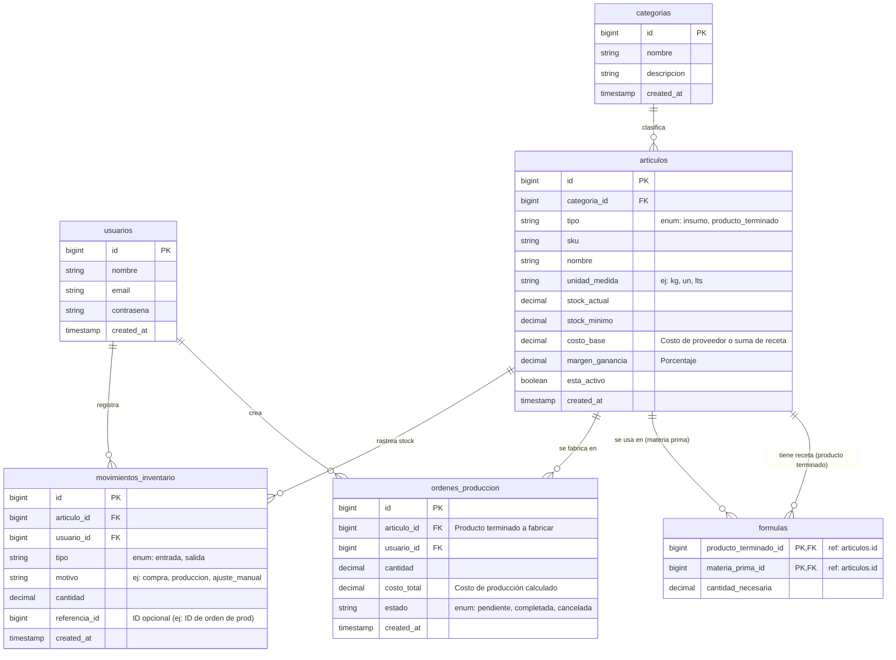

# Diagrama de Entidad-Relación (DER)

```mermaid
erDiagram
    usuarios ||--o{ ordenes_produccion : "crea"
    usuarios ||--o{ movimientos_inventario : "registra"
    categorias ||--o{ articulos : "clasifica"
    articulos ||--o{ formulas : "tiene receta (producto terminado)"
    articulos ||--o{ formulas : "se usa en (materia prima)"
    articulos ||--o{ ordenes_produccion : "se fabrica en"
    articulos ||--o{ movimientos_inventario : "rastrea stock"

    usuarios {
        bigint id PK
        string nombre
        string email
        string contrasena
        timestamp created_at
    }

    categorias {
        bigint id PK
        string nombre
        string descripcion
        timestamp created_at
    }

    articulos {
        bigint id PK
        bigint categoria_id FK
        string tipo "enum: insumo, producto_terminado"
        string sku
        string nombre
        string unidad_medida "ej: kg, un, lts"
        decimal stock_actual
        decimal stock_minimo
        decimal costo_base "Costo de proveedor o suma de receta"
        decimal margen_ganancia "Porcentaje"
        boolean esta_activo
        timestamp created_at
    }

    formulas {
        bigint producto_terminado_id PK, FK "ref: articulos.id"
        bigint materia_prima_id PK, FK "ref: articulos.id"
        decimal cantidad_necesaria
    }

    ordenes_produccion {
        bigint id PK
        bigint articulo_id FK "Producto terminado a fabricar"
        bigint usuario_id FK
        decimal cantidad
        decimal costo_total "Costo de producción calculado"
        string estado "enum: pendiente, completada, cancelada"
        timestamp created_at
    }

    movimientos_inventario {
        bigint id PK
        bigint articulo_id FK
        bigint usuario_id FK
        string tipo "enum: entrada, salida"
        string motivo "ej: compra, produccion, ajuste_manual"
        decimal cantidad
        bigint referencia_id "ID opcional (ej: ID de orden de prod)"
        timestamp created_at
    }
```