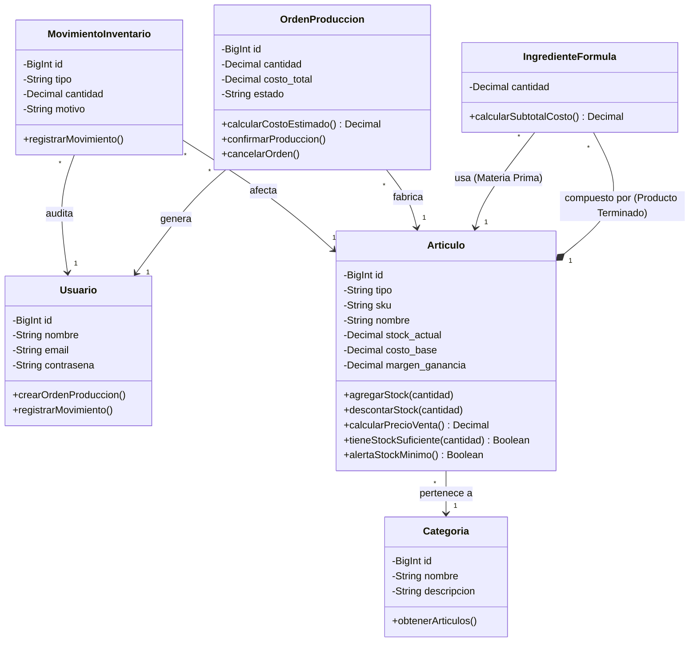

# Diagrama de Objetos (DO)

```mermaid
classDiagram
    direction BT

    class Usuario {
        -BigInt id
        -String nombre
        -String email
        -String contrasena
        +crearOrdenProduccion()
        +registrarMovimiento()
    }

    class Categoria {
        -BigInt id
        -String nombre
        -String descripcion
        +obtenerArticulos()
    }

    class Articulo {
        -BigInt id
        -String tipo
        -String sku
        -String nombre
        -Decimal stock_actual
        -Decimal costo_base
        -Decimal margen_ganancia
        +agregarStock(cantidad)
        +descontarStock(cantidad)
        +calcularPrecioVenta() Decimal
        +tieneStockSuficiente(cantidad) Boolean
        +alertaStockMinimo() Boolean
    }

    class IngredienteFormula {
        -Decimal cantidad
        +calcularSubtotalCosto() Decimal
    }

    class OrdenProduccion {
        -BigInt id
        -Decimal cantidad
        -Decimal costo_total
        -String estado
        +calcularCostoEstimado() Decimal
        +confirmarProduccion()
        +cancelarOrden()
    }

    class MovimientoInventario {
        -BigInt id
        -String tipo
        -Decimal cantidad
        -String motivo
        +registrarMovimiento()
    }

    %% Relaciones
    Articulo "1" *-- "*" IngredienteFormula : compuesto por (Producto Terminado)
    Articulo "1" <-- "*" IngredienteFormula : usa (Materia Prima)
    Categoria "1" <-- "*" Articulo : pertenece a
    Usuario "1" <-- "*" OrdenProduccion : genera
    Articulo "1" <-- "*" OrdenProduccion : fabrica
    Articulo "1" <-- "*" MovimientoInventario : afecta
    Usuario "1" <-- "*" MovimientoInventario : audita
```